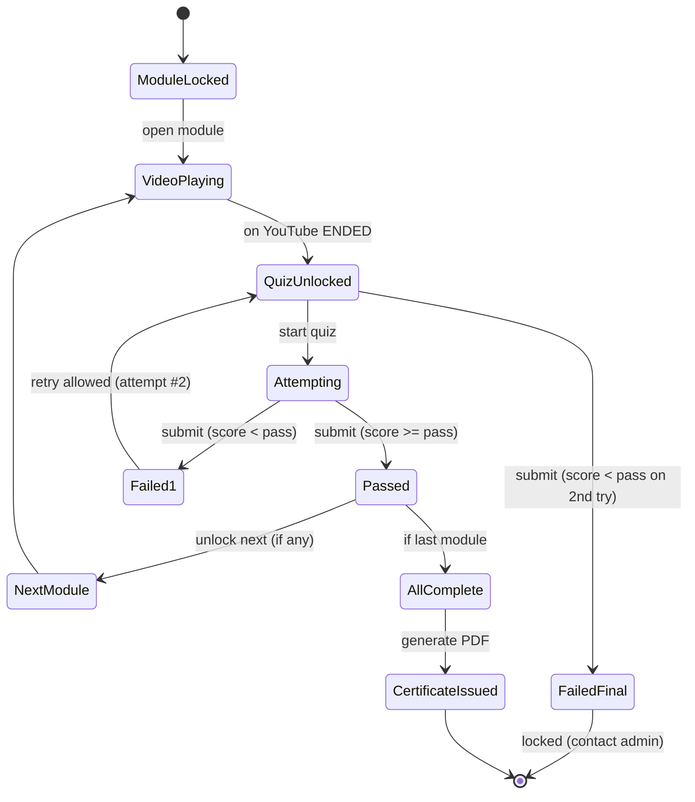

# Video Quiz App – Project Specification & Architecture Blueprint

> Single source of truth for how the system works **under the hood**. Functionality first; styling later.

---

## 1) System Architecture Overview

The app uses **Next.js 14+ (App Router) + TypeScript** for both UI and API routes, **Prisma** for data access, **PostgreSQL (Supabase)** for storage, **NextAuth (Credentials)** for sessions, **React Query** for client caching, **Zod** for validation, and **pdfkit** for certificate generation. The **YouTube IFrame Player API** gates the quiz until the video is fully watched.

### 1.1 High‑level component diagram
```mermaid
flowchart LR
    subgraph Client [Client (Browser)]
      UI[Next.js React UI]
    end

    subgraph Server [Next.js Server]
      API[API Routes / NextAuth<br/>Zod validation]
      SVC[Backend Services (TS modules)<br/>scoring / gating / certs / reporting]
      DB[(PostgreSQL via Prisma)]
    end

    subgraph ThirdParty [Third-Party]
      YT[YouTube IFrame API]
      PDF[PDFKit (server lib)]
      MAIL[Email Provider (invites/reset)]
    end

    UI -- sign in / fetch / submit --> API
    API -- business logic --> SVC
    SVC -- queries --> DB
    UI -- embed --> YT
    API -- generate --> PDF
    API -- send --> MAIL
    API -- set session cookie --> UI
    UI -- download cert --> API
```

### 1.2 Example request flow (login → certificate)
```mermaid
sequenceDiagram
    participant U as Employee (Browser)
    participant FE as Next.js Frontend
    participant BE as API + NextAuth
    participant DB as Postgres (Supabase)
    participant YT as YouTube IFrame API
    participant PDF as PDFKit

    U->>FE: Open /login
    FE->>BE: POST /api/auth/callback (credentials)
    BE->>DB: Verify (email + bcrypt)
    DB-->>BE: User (role)
    BE-->>U: Set session cookie; redirect to /

    U->>BE: GET /api/modules
    BE->>DB: Query modules + attempts
    DB-->>BE: Data (unlocked/locked)
    BE-->>U: JSON (modules & progress)

    U->>YT: Play Module 1 video (iframe)
    YT-->>FE: onEnded
    U->>BE: GET /api/quiz?moduleId=1
    BE->>DB: Fetch questions (randomize)
    DB-->>BE: Questions
    BE-->>U: JSON (quiz)

    U->>BE: POST /api/attempt (answers)
    BE->>DB: Create Attempt (append-only)
    BE-->>U: Pass/Fail + attemptsRemaining

    alt Last module passed
      U->>BE: GET /api/certificate
      BE->>DB: Verify completion
      BE->>PDF: Generate PDF
      PDF-->>BE: Buffer/Path
      BE->>DB: Create Certificate
      BE-->>U: PDF stream / URL
    end
```

---

## 2) Data Model & ER Diagram

Entities: **User**, **Module**, **Quiz**, **Question**, **Attempt** (append‑only), **Certificate**. Two roles only: **ADMIN** and **EMPLOYEE**.

```mermaid
erDiagram
    USER ||--o{ ATTEMPT : "makes"
    QUIZ ||--o{ QUESTION : "has"
    USER ||--o{ CERTIFICATE : "earns"
    MODULE ||--|| QUIZ : "has 1:1"
    QUIZ ||--o{ ATTEMPT : "is attempted by"

    USER {
      string id PK
      string email UNIQUE
      string passwordHash
      string name
      enum role  // ADMIN | EMPLOYEE
      datetime createdAt
    }
    MODULE {
      string id PK
      int    order UNIQUE
      string title
      string description
      string youtubeId
    }
    QUIZ {
      string id PK
      string moduleId FK UNIQUE
      int    passScore
      int    timeLimitSeconds
    }
    QUESTION {
      string id PK
      string quizId FK
      string text
      string[] options
      int    correctIndex
      bool   active
    }
    ATTEMPT {
      string id PK
      string userId FK
      string quizId FK
      int    attemptNo // 1 or 2
      int    score
      bool   passed
      json   answersJson
      datetime submittedAt
      index (userId, quizId)
    }
    CERTIFICATE {
      string id PK
      string userId FK
      datetime issuedAt
      int    totalScore
      string filePath
    }
```

**Rules & constraints**
- One **Quiz per Module** (`QUIZ.moduleId` UNIQUE).  
- **Max 2 attempts** per (user, quiz) — enforced in service layer.  
- **Append‑only** attempts for audit.  
- Modules are **sequential** (`order` INT). Next unlocks only if previous passed.  
- Certificate exists only when **all modules passed**.

---

## 3) API Contracts (summary)

All payloads validated with **Zod**. Auth via **NextAuth** session cookie. Admin routes require `role=ADMIN`.

### 3.1 Auth
- **POST** `/api/auth/callback/credentials` (NextAuth)  
  **Body**: `{ email, password }` → **200** sets cookie; `{ user: {id,email,role} }`  
  **Errors**: 400 invalid payload; 401 invalid credentials

- **POST** `/api/auth/logout` → **204**; clears session

- **POST** `/api/admin/invite` (ADMIN)  
  **Body**: `{ email, name? }` → **200** `{ message }` (sends invite email)  
  **Errors**: 403 not admin; 409 email exists

### 3.2 Modules & Quiz
- **GET** `/api/modules` → **200** `[ { id, title, order, youtubeId, unlocked, passed, attemptsUsed } ]`  
- **GET** `/api/modules/:id` → **200** module detail (no questions) or **404**  
- **GET** `/api/quiz?moduleId=...` → **200** `{ quizId, moduleId, timeLimit, passScore, attemptsRemaining, questions:[{questionId,text,options[]}] }`  
  **Errors**: 403 (locked or attempts exhausted), 404 (bad module), 401 (unauth)

### 3.3 Attempt
- **POST** `/api/attempt`  
  **Body**: `{ quizId, answers:[{questionId, answerIndex}], timeTaken? }`  
  **200** `{ passed, score, attemptNo, attemptsRemaining }`  
  **Errors**: 400 (validation), 403 (3rd attempt or wrong sequence), 401

### 3.4 Certificate
- **GET** `/api/certificate`  
  **200** PDF stream or `{ certificateUrl }` if stored; **403** if not complete

### 3.5 Admin content
- **POST** `/api/admin/modules` → **201** module  
- **PUT** `/api/admin/modules/:id` → **200** updated  
- **POST** `/api/admin/quizzes` (create/update quiz config)  
- **POST** `/api/admin/questions` (add) / **PUT** `/api/admin/questions/:id` (edit) / **DELETE** (remove)  
- **GET** `/api/admin/progress` (user/module attempts overview)  
All return standard 4xx/5xx on error with `{ error, details? }`

---

## 4) Quiz Flow & State Transitions



**Enforcement**
- Server checks **sequence** and **attempt cap** regardless of UI.  
- Options & question order **shuffled** each fetch.  
- Timer enforced in UI; server can reject late submits if provided.  
- No back‑nav, focus/fullscreen guard (front‑end).

---

## 5) Security Model

- **AuthN**: NextAuth (Credentials), bcrypt password hashing, **HTTP‑only** cookies, `Secure`, `SameSite=Lax/Strict`, CSRF on auth routes.  
- **AuthZ**: `User.role` in session; middleware/route guards for `/admin/*`; employees limited to their own data.  
- **MFA for Admin** (TOTP/WebAuthn) recommended; enforced at login callback.  
- **Validation**: Zod on every API; Prisma prevents SQLi; sanitize outputs.  
- **Rate limiting**: login + attempt routes.  
- **CSP**: allow YouTube frame/script; block unknown; `frame-ancestors 'self'`.  
- **Audit**: append‑only attempts; optional admin action audit (resets, edits).  
- **Secrets**: env vars (`DATABASE_URL`, `NEXTAUTH_SECRET`, SMTP keys).  
- **PII**: minimal in logs; no tokens in localStorage.

---

## 6) Deployment & Local Development

**Local**
- Dockerized Postgres or Supabase local; `.env.local` with `DATABASE_URL`, `NEXTAUTH_URL`, `NEXTAUTH_SECRET`.  
- `npx prisma migrate dev` → create schema; optional `prisma/seed.ts`.  
- `npm run dev` (Next.js dev server).  
- `npx prisma studio` for DB inspect.

**Production**
- **Vercel** hosts Next.js (UI + API).  
- **Supabase Postgres** as managed DB.  
- CI/CD: build → `prisma migrate deploy` → deploy.  
- Secrets in Vercel env.  
- PDF generation via pdfkit (stream or store in Supabase Storage/S3).  
- Monitoring: Vercel logs; optional Sentry.

---

## 7) Appendix (related docs in your repo)

- **Tech Stack (opinionated):** `video-quiz-opinionated-tech-stack.md`  
- **Auth Must‑Haves:** `video-quiz-auth-must-haves.md`  
- **Admin Portal Must‑Haves:** `video-quiz-admin-portal-must-haves.md`  
- **User Portal Must‑Haves:** `video-quiz-user-portal-must-haves.md`  

> Styling is intentionally deferred until all core flows are verified: auth → video gate → quiz (2 attempts) → sequential unlock → certificate.
